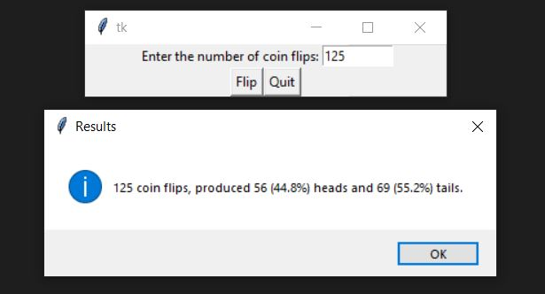

# Probability-Simulation-2

Coin flipping program to simulate the probability of heads and tails.

To run the simulator:
1. Download both Python files into one folder
2. Run the coin_GUI_main.py
3. Follow on-screen widget instructions

